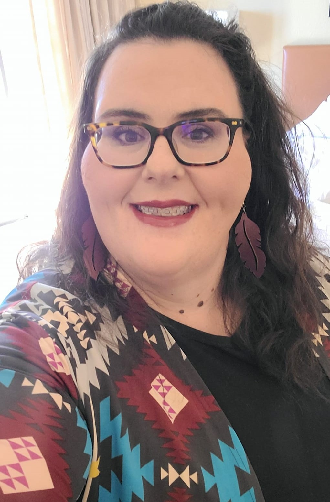
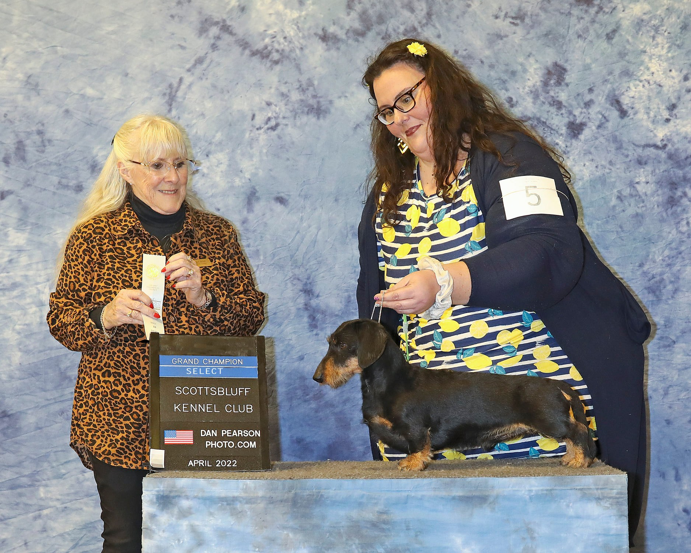
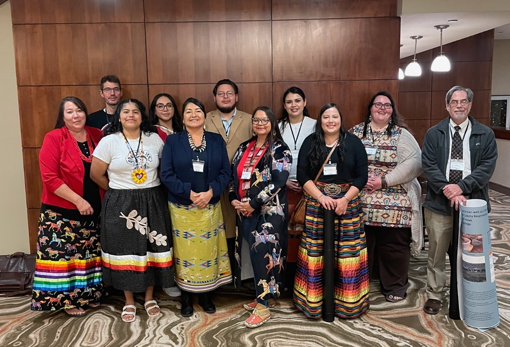

### Dana R. Gehring
I am a faculty mentor for the [ESIIL stars](https://esiil.org/) 2026 program.  This is my 4th year of being a mentor for this program.  I am the Math Science and Technology department chair at [Oglala Lakota College](https://www.olc.edu/) and a Biology assistant professor. 2026 is my 21st year of teaching at tribal colleges. 
I am owned by several wirehair dachshunds.  I enjoy going to dog shows, hunting, and sporting events with my dogs.  

* [Email](danag@olc.edu)
* [Linkedin](https://www.linkedin.com/in/dana-gehring/)
* GitHub: drg799802
* [OLC MST Facebook](https://www.facebook.com/profile.php?id=100088294075839)

## GCH DC GRD's v Moonlight's Sharp Dressed Man MW DCAT aka Tux

## OLC Science at FALCON 2024
